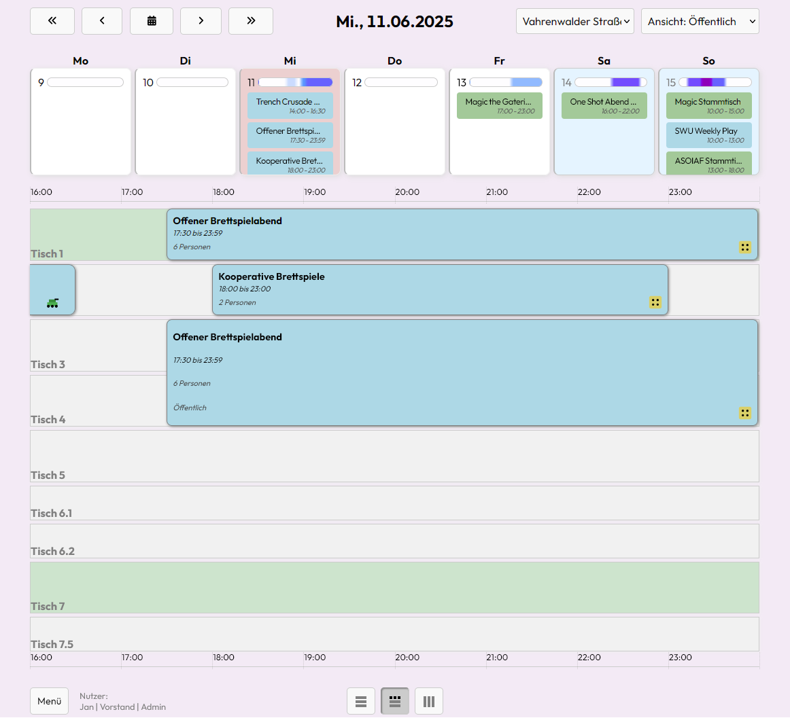
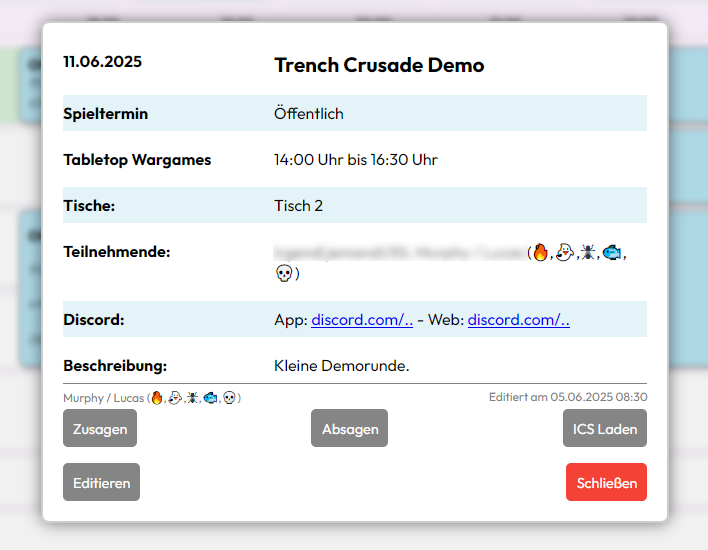
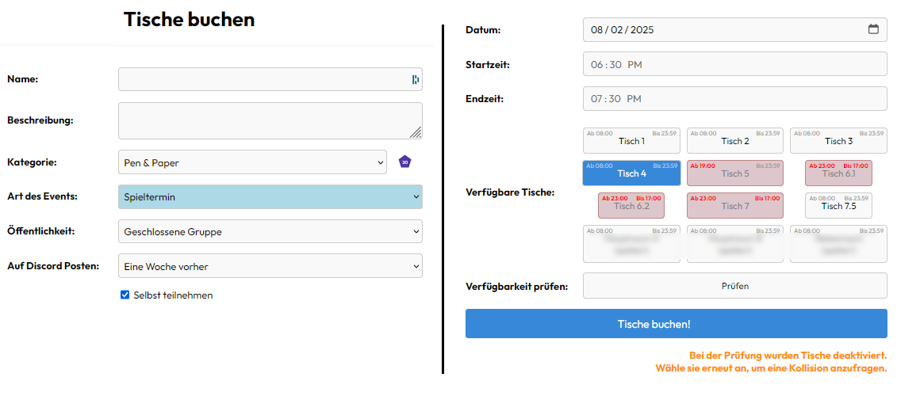
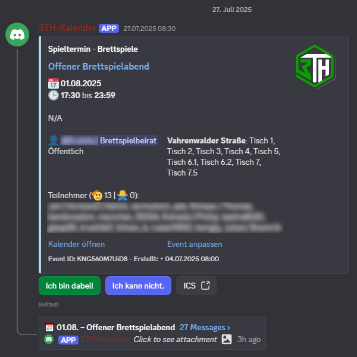
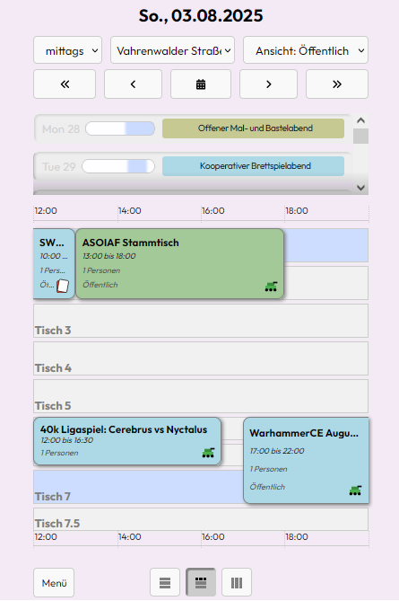

## Wer?

In diesem Repo wird das Buchungssystem des 3TH entwickelt. 

Der [TableTopTreff Hannover](https://tabletoptreff-hannover.de/) ist mit über 200 Mitgliedern einer der größten Vereine Deutschlands für Tabletop-, Brett- und Rollenspiele. 

## Was?

Threadbound ist ein Buchungssystem. Unsere ~1500 Termine pro Jahr waren in einem üblichen Kalender nicht mehr vernünftig zu tracken: Häufige Doppelbuchungen, unhandliche Notizen für die Buchung bestimmter Tische, 20+ verschiedene Kalender für die Spielsysteme... 

Threadbound ist unsere Lösung für digitale Reservierungen. 

Es ist an die Kommunikationsplattform des Vereins (Discord) angebunden und spiegelt unsere Vereinsstruktur aus einem Vorstand und größerem Beirat mit regelmäßigen Stammtischen, Spielterminen und Turnieren sowie öffentlichen und geschlossenen Veranstaltungen auf beliebig vielen Tischen in zwei Räumlichkeiten wieder.

Demo: [Kalender des TableTopTreffs Hannover e. V.](https://3th-test.tabletoptreff.de/calendar/)

### **Architekturüberblick**

- **Frontend:** Jinja, HTML, HTMX, JS
- **Backend:** Python (*Flask, SQLAlchemy, APScheduler*)
- **Auth:** über Discord (*OAuth2*)
- **Datenbank:** SQLite


## Funktionen

#### Angeschlossen an Discord:
- SSO-Login mit übernahme der Server-Nicknames
- Rollenprüfung
- Automatische Posts mit übersichtlichem Embed und Thread für Absprachen zum Event
- Einstellbare Vorlaufzeit, wann das Event auf Discord gepostet wird
- Erinnerungsmeldungen für Ersteller und Absagemeldungen and Personen, die zugesagt haben
#### Funktionen der App:
- moderne Kalenderansicht auf allen Geräten
- Erstellen von Events mit Reservierung von Tischen in mehreren Räumen
- Zusagen und Absagen per App und Discord-Buttons möglich
- Unabsichtliche Doppelbuchungen werden geprüft und verhindert
#### Funktionen des Servers:
- Ausgeklügeltes System für Vormerkungen (Events, die noch Zustimmungen bedürfen)
- Discord-Tickets zur Absprache des Buchenden mit relevanten Personen bei:
  - Absichtliche Event-Überlagerung z. B. bei Turnieren (*bestehendes Event muss zustimmen*)
  - Zu große Buchungen z. B. 4+ Tische (*Vorstand muss zustimmen*)
- Änderungen im Kalender werden erkannt, Vormerkungen und Tickets entsprechend aufgelöst.
#### Sonstiges:
- Per Rolle zuweisbare Rechte "Stammtische" (regelmäßige Events) einzutragen.
- ICS Export für Events oder ganze Kalender
- Analytics der eingetragenen Events
- Leichte Bedienung, große Zahl an Shortcuts, Infozeile, Poweruser-Features

## Beispielbilder

### Hauptansicht in der App


### Ansicht einer Reservierung in der App


### Buchungs-Formular in der App


### Discord Event-Post mit Zusagen, Absagen und Thread


### Mobile Ansicht der App


# Selbst aufsetzen

## Voraussetzungen

## Einstellungen

```Environment variables
# Server Setup
OAUTHLIB_INSECURE_TRANSPORT=1
SERVER_NAME=
SECRET_KEY=

# Discord SSO
REDIRECT_URI=https://SERVERNAME/login/discord/authorized
CLIENT_ID=
CLIENT_SECRET=

# Discord Setup
DISCORD_TOKEN=
PERMISSION_INT=309237721152
GUILD_ID=
MEMBER_ROLE_ID=
BEIRAT_ROLE_ID=
VORSTAND_ROLE_ID=
MOD_ROLE_ID=
ADMIN_ROLE_ID=
TICKET_CATEGORY_ID=
TICKET_LOG_ID=

BOT_ROLE_ID=

```


### 🛠️ `.env` Konfigurationsübersicht

Folgende Umgebungsvariablen müssen gesetzt werden, um die Anwendung korrekt zu betreiben:


| Variable | Beschreibung |
|----------|--------------|
| Server Setup |
| `OAUTHLIB_INSECURE_TRANSPORT=1` | Aktiviert OAuth über HTTP für lokale Entwicklung. |
| `SERVER_NAME=` | Vollständiger Hostname (z. B. `kalender.beispiel.de`). |
| `SECRET_KEY=` | Geheimer Schlüssel für Flask Sessions. Sollte ein langer, zufälliger Wert sein (z. B. mit `openssl rand -hex 32` erzeugt). |
| Discord - SSO |
| `REDIRECT_URI=` | Muss mit der Redirect-URI in deiner Discord Developer App übereinstimmen. Typisch: `https://<deinserver>/login/discord/authorized` |
| `CLIENT_ID=` | Client ID aus deiner Discord Developer App |
| `CLIENT_SECRET=` | Client Secret aus deiner Discord Developer App |
| Discord - Bot |
| `DISCORD_TOKEN=` | Bot-Token für deinen Discord-Bot (Discord Developer)  |
| `PERMISSION_INT=309237721152` | Berechtigungs-Integer für den Bot-Invite-Link (legt fest, was der Bot darf) |
| `GUILD_ID=` | Die Discord Server-ID.  |
| `MEMBER_ROLE_ID=` | Rollen-ID für die Mitgliederrolle (Berechtigt Events zu erstellen) |
| `BEIRAT_ROLE_ID=` | Rollen-ID für gehobene Rolle (Berechtigt Stammtische zu erstellen) |
| `VORSTAND_ROLE_ID=` | Rollen-ID für höchste Zugriffsrechte (Berechtigt, Events zu Löschen und zuzusagen) |
| `MOD_ROLE_ID=` | useless atm |
| `ADMIN_ROLE_ID=` | Rollen-ID für Admins (berechtigt, Admin-Views zu sehen und Datenbankänderungen zu tätigen) |
| `TICKET_CATEGORY_ID=` | Kategorie, in der der Bot berechtigt ist, Channel zu verwalten.
| `TICKET_LOG_ID=` | Channel in welchen die Logs der geschlossenen Tickets als .txt hinterlegt werden sollen |
| `BOT_ROLE_ID=`| Rollen-ID des Bots auf dem Discordserver. 

---


Der aktuelle Branch der Entwicklung ist "htmx"