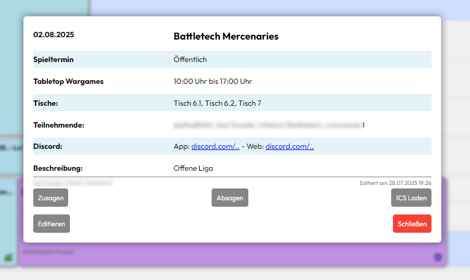

<p align="center">

</p>

<p align="center">
  <a href="https://hub.docker.com/r/janweigang/threadbound">
    
  </a>
  <a href="https://github.com/Jan-Weigang/threadbound/actions">
    
  </a>
  
  <a href="https://github.com/Jan-Weigang/threadbound/releases">
    
  </a>
</p>
<p align="center">
  
  
  
</p>


### Inhalt
- [Überblick](#überblick)
- [Funktionen](#funktionen)
- [Beispielbilder](#beispielbilder)
- [Anleitung zum selbsthosten](#anleitungen)
- [Lizenz](#lizenz)


## Überblick

In diesem Repo wird das Buchungssystem des 3TH entwickelt. 

Der [TableTopTreff Hannover](https://tabletoptreff-hannover.de/) ist mit über 200 Mitgliedern einer der größten Vereine Deutschlands für Tabletop-, Brett- und Rollenspiele. 

### Was ist Threadbound?

Threadbound ist ein Buchungssystem. Unsere ~1500 Termine pro Jahr waren in einem üblichen Kalender nicht mehr vernünftig zu tracken: Häufige Doppelbuchungen, unhandliche Notizen für die Buchung bestimmter Tische, 20+ verschiedene Kalender für die Spielsysteme... 

**Threadbound ist unsere Lösung für digitale Reservierungen.**

Es ist an die Kommunikationsplattform des Vereins (Discord) angebunden und spiegelt unsere Vereinsstruktur aus einem Vorstand und größerem Beirat mit regelmäßigen Stammtischen, Spielterminen und Turnieren sowie öffentlichen und geschlossenen Veranstaltungen auf beliebig vielen Tischen in zwei Räumlichkeiten wieder.

Demo: [Kalender des TableTopTreffs Hannover e. V.](https://3th-test.tabletoptreff.de/calendar/)

#### Architekturüberblick

- **Frontend:** Jinja, HTML, HTMX, JS
- **Backend:** Python (*Flask, SQLAlchemy, APScheduler*)
- **Auth:** über Discord (*OAuth2*)
- **Datenbank:** SQLite


## Funktionen

### Angeschlossen an Discord:
- SSO-Login mit übernahme der Server-Nicknames und Server-Rollen
- Automatische Posts mit übersichtlichem Embed und Thread für Absprachen zum Event
- Einstellbare Vorlaufzeit für automatische Posts und Erinnerungsmeldungen
### Funktionen der App:
- moderne Kalenderansicht auf allen Geräten
- Erstellen von Events mit Reservierung von Tischen in mehreren Räumen
- Zusagen und Absagen per App und Discord-Buttons
- Unabsichtliche Doppelbuchungen werden geprüft und verhindert
### Funktionen des Servers:
- Ausgeklügeltes System für Vormerkungen und Absprachen per Ticket, z. B. bei:
  - Absichtlichen Event-Überlagerungen z. B. bei Turnieren (*bestehendes Event muss zustimmen*)
  - Zu große Buchungen z. B. 4+ Tische (*Vorstand muss zustimmen*).
### Sonstiges:
- Per Rolle zuweisbare Rechte "Stammtische" (regelmäßige Events) einzutragen.
- ICS Export, Statistik der Buchungen, große Zahl an Shortcuts & Poweruser-Features

## Beispielbilder

### Hauptansicht in der App


<details>
<summary><b>Weitere Bilder anzeigen</b></summary>

### Ansicht einer Reservierung in der App


### Buchungs-Formular in der App


### Discord Event-Post mit Zusagen, Absagen und Thread


### Mobile Ansicht der App

</details>

## Anleitungen

### Voraussetzungen

Die App lässt sich per Docker starten. Es wird ein Reverse Proxy empfohlen, der die für den SSO notwendige SSL-Verschlüsselung bereitstellt. 

Das Docker Image ist auf [Docker Hub](https://hub.docker.com/r/janweigang/threadbound) hinterlegt und can per Docker Compose genutzt werden:


### compose.yaml
```yaml
services:
  threadbound:
    image: janweigang/threadbound:latest
    restart: unless-stopped
    ports:
      - "[PORT EINTRAGEN]:5000"
    volumes:
      - ./db_data:/usr/src/app/instance
    env_file:
      - .env
volumes:
  db_data:
```

Werte in eckigen Klammern sind selbst je nach Setup zu ersetzen.

### .env
```python
# Server Setup (Domain and Cookie Signing Key)
SERVER_NAME=
SECRET_KEY=

# Discord SSO (get these mostly from Discord Developer Portal)
REDIRECT_URI=https://[SERVER_NAME EINTRAGEN]/login/discord/authorized
CLIENT_ID=
CLIENT_SECRET=

# Discord-Bot Setup
DISCORD_TOKEN=
PERMISSION_INT=309237721152

GUILD_ID=
TICKET_CATEGORY_ID=
TICKET_LOG_ID=

# Single ID
BOT_ROLE_ID=

# Role Setup - Single ID or comma-separated list of IDs
MEMBER_ROLE_ID=
BEIRAT_ROLE_ID=
VORSTAND_ROLE_ID=
ADMIN_ROLE_ID=

```

### Discord Developer Portal

Melde dich im [Discord Developer Portal](https://discord.com/developers/applications) und erstelle eine neue Application.

#### OAuth2:
Stelle OAuth2 ein, kopiere Client ID und Client Secret in die .env und trage dieselbe "REDIRECT_URI" in Discord Developer Portal und der .env-Datei ein.

#### Bot:
Erstelle hier einen Bot und kopiere das Token in die .env-Datei.
Der Bot sollte öffentlich gestellt sein und die Intents "Server Members Intent" und "Message Content Intent" aktiviert haben.


<details>
<summary><b>Bot & nginx Beispiele anzeigen</b></summary>

#### Bot -> Permissions


Stelle sicher, dass der Bot nachdem er mit dem Server verknüpft ist, die entsprechenden Rechte auf dem Server und in den entsprechenden Kanälen erhält. 

#### nginx Beispielsetup

```nginx
server {
  server_name beispiel.domain.de;
  
  location / {
    proxy_pass http://localhost:[PORT EINTRAGEN];
    proxy_set_header Hose $host;
    proxy_set_header X-Real-IP $remote_addr;
    proxy_set_header X-Forwarded-For $proxy_add_x_forwarded_for;
    proxy_set_header X-Forwarded-Proto $scheme;

    listen 443 ssl; # managed by Certbot
    [...]
  }
}
```

</details>

## Lizenz

Dieses Projekt wurde unter **GPL v3** veröffentlicht.